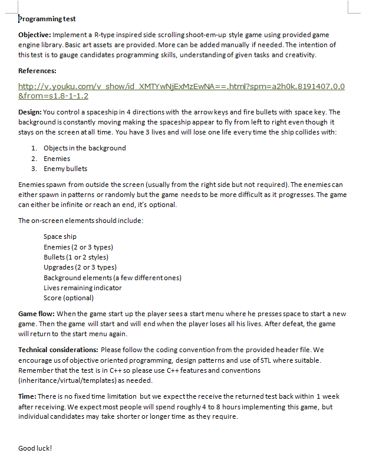
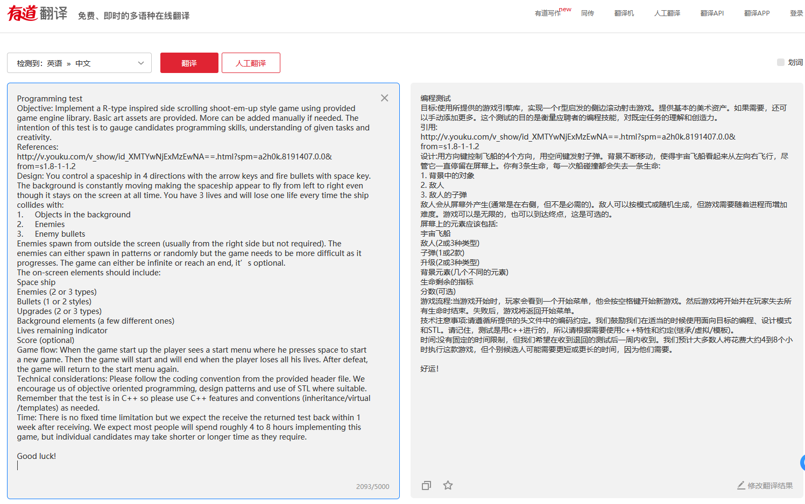
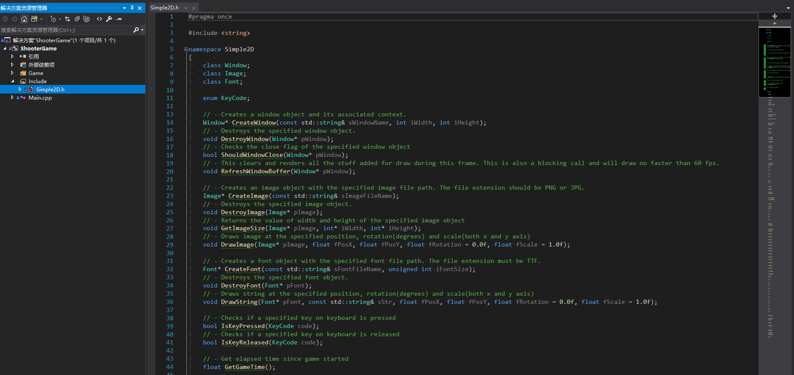
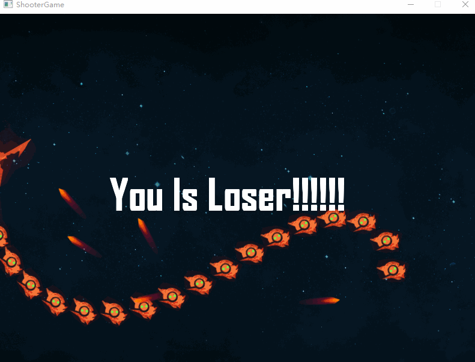

# ShooterGameTemplate

## 前言

3天前, 在某群看到有人发招聘测试题, 一时没压抑住内心做题的冲动, 决定做了这道题.

先看下题目要求: 

好家伙, 纯阴文题目, 但这些英文并不复杂, 都是些简单的词汇. 在这里, 我想告诉大家一个技巧, 只要两步, 就可以轻轻松松克服看不懂英文的困扰.

**技巧:**
* *Ctrl + C*
* *Ctrl + V*

两步操作, 一气呵成, 

题目大意是在提供的基本环境里, 实现一个飞机大战游戏.

**这个游戏有几条硬性规定:**
* 滚动的背景
* 敌人
* 子弹
* *(其余规定咱们选择性没看见)*

**再看看题目为我们提供了什么**

提供的文件有
* Simple2D.h
* Main.cpp

提供的接口在截图里一目了然, 已经足够满足实现一个小游戏了.

大概明白题意后, 就开始规划游戏内容了. 不停歼灭重复出现的敌人很枯燥, 咱们直接就打Boss, 一局定胜负.

首先, 游戏基本的框架就不详细说明了, 想了解直接看代码, 也没几行.

**主要内容:**

* 碰撞, 玩家和敌人会发生碰撞, 玩家的子弹和敌人的子弹也会发生碰撞.

* Boss, Boss是参照贪吃蛇设计的, 它的外形是蛇, 运动方式是游动的.

* 惯性, Boss由多节肢组成, 子弹打在节肢上, 节肢会受惯性影响发生偏移.

**代码组织架构:**

* Game.h 提供基础框架
* Play.h 实现游戏玩法
* Math.h 一些数学函数

**游戏演示**

*战败*

*战胜*

*Boss秀*

*骨骼偏移*

*子弹碰撞*

[原题目](ReadMe/ShooterGameTemplate.zip)
